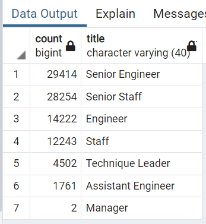
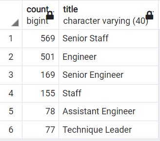

# Pewlett Hackard Analysis

## Overview
The HR department of Pewlett Hackard, a company with several thousand employees, is in need of an analysis of the number and positions of employees coming near retirement age to make projections. They are looking to:
- Offer retirement options for those who meet certain criteria
- Predict which positions will need to be filled in the near future

The employee data has been provided in the form of six .csv files. The department also neeeds to have this data imported into, and processed in a SQL database. pgAdmin and PostgreSQL was used to perform this operation.

## Results
- A query of employees born between 1952 and 1955 returns around 90,000 employees. 
- An initial query of the [employees table](data/employees.csv) returns around 300,000 unique employees.
- Of those, more than half are engineering positions (as seen below)



*Total retiring employees by position title*

 - A query of employees eligible for mentorship (defined as born in the year 1965), returns around 1,500. 
 
## Summary

### How many roles will need to be filled as the "silver tsunami" begins to make an impact?
About 30% of the company's total workforce will be retiring shortly, about 90,000 employees.

### Are there enough qualified, retirement-ready employees in the departments to mentor the next generation of Pewlett Hackard employees?
There are about 1,500 that could be available for a mentoring program. There will be a big gap to fill if these people are meant to mentor the newcomers, with a 60 to 1 mentee to mentor ratio.

With about 45,000 engineering positions to be filled, it would be useful to find out how many engineering mentors will be available. By running:
```
SELECT COUNT(title), title
FROM mentorship_eligibilty
GROUP BY title
ORDER BY COUNT(title) DESC;
```
We get:



*Total employees eligible to mentor by position title*

These results are still pointing to the same 60 to 1 ratio for mentee/mentor in engineering positions.

We can also see above, that there will be 2 managers retiring shortly. It would be useful to find out which departments will need to have these two positions filled. By running:
```
SELECT mi.dept_name
FROM unique_titles AS ut
INNER JOIN manager_info AS mi
ON ut.emp_no = mi.emp_no
WHERE ut.title = 'Manager'
ORDER BY mi.dept_name;
```
We find that **Research** and **Sales** will need to have the Manager position filled shortly.